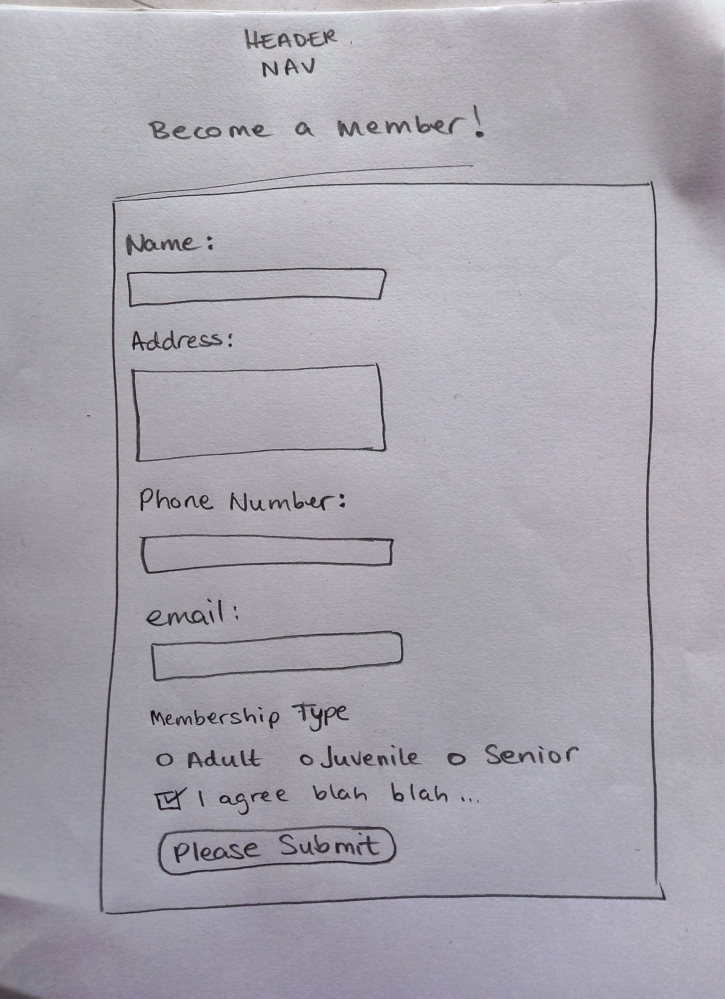

# Project Portfolio 1 - HTML and CSS Essentials

# Mattie McDonagh Centre - a community centre based in Ballygar, County Galway
## by Veronica Quinn

### [Click here to view the site](https://veronicaquinn.github.io/project-one-mattie-mcdonagh-centre/)
### [Click here to view the repository.](https://github.com/VeronicaQuinn/project-one-mattie-mcdonagh-centre)

## Project Objectives
The main objective of this project is to demonstrate competency in HTML and CSS languages.  I am creating a website for the Mattie McDonagh Community Centre campus in Ballygar, County Galway, Ireland.  My hope would be that this would eventually serve as the framework to create a genuine website in the future.  My intention is to showcase everything the facility has to offer with a clean design, accessibility and easy-to- navigate pages which includes all the required learning outcomes.
 
 

## UX Planes

### STRATEGY PLANE
### Brief

The Mattie McDonagh Centre, (henceforth known as "the Centre") is managed by the Ballygar & Districts Co Ltd committee which is entirely made up of volunteers

The committee wants this website:
<ol>
<li>To showcase and promote the Centre as a venue both within the local community and to also reach a wider audience</li>
<li>To increase membership</li>
<li>To provide up-to-date information to users and the broader community</li>
</ol>
 

### SCOPE PLANE

The four pages of the website will be designed with a view to meeting each of the three main aims individually but with a cohesive flow between them

<ul>
<li>The <u>HOME</u> page will give a brief history of the Mattie McDonagh Centre and a description of its place in the community.  It will contain links to the other pages within the website, external links for email, phone and an embedded google map</li>
<li>The <u>SCHEDULE</u> page will contain a table featuring the sports hall schedule</li>
<li>The <u>FACILITIES</u> page will include numerous images of everything that the Centre has to offer</li>
<li>The <u>BECOME A MEMBER!</u> page will contain a membership form which will include different input types, radio buttons, a checkbox and submit with a number of required inputs</li>
 

### STRUCTURE PLANE

### The Home Page
The index.html page will have:
<ul>
<li>a HEADER with a three-word logo to the left.  To the right will be a phone number, email and address, all with working links.  To their right there is an embedded map with a working link.  The HEADER, NAVIGATION BAR and FOOTER will all feature throughout all the website pages</li>
<li>a NAVIGATION BAR (a Menu) with the headings:
<ul>
<li>HOME</li>
<li>SCHEDULE</li>
<li>FACILITIES and</li>
<li>BECOME A MEMBER!</li>
</ul>
</li>
<li>an ABOUT section with content about the Centre and containing an image</li>
<li>a section with a CALL TO ACTION including images, link to membership.html page and fee schedule</li>
<li>a FOOTER with social media links for Facebook, Twitter, YouTube and Istagram</li>
</ul>
 

### The Schedule Page

The schedule.html page will contain a TABLE with the schedule for the main sports hall
 

### The Facilities Page

The facilities.html page will feature:
<ul>
<li>an IMAGE of the main sports hall</li>
<li>a section with content about the SPORTS HALL and what it has to offer and an image of a banquet that took place there</li>
<li>a section about the NIALL WALSH FIELD containing two images and a paragraph about the DRESSING ROOMS</li>
<li>a section about the GYM with an image</li>
<li>a section about the KITCHEN with an image</li>
</ul>
 

### The Become a Member! Page

The membership.html page will contain a form requiring the following input fields:
<ul>
<li>Name</li>
<li>Address</li>
<li>Phone Number</li>
<li>Email </li>
<li>Radio Buttons for 'Membership Type:  Adult, Juvenile and Senior'</li>
<li>Checkbox with an Agree Conditions paragraph</li>
<li>'Please Submit' button</li>

</ul>

</ul>

### Skeleton Plane

### Home Page-index.html
 

I removed the background image in the Header in favour of a hero-image as it was more visually appealing and better for accessibility.  I added a 'call-to-action' section, both to make the site easier to navigate and to fill out the home page and to fulfil the brief of increasing membership and as another link to the facilities page which has the most visual impact

 

### Schedule Page-schedule.html
 

I added a horizontal scroll bar as a media query because the table element should maintain its structural integrity.  I will replace the table element in the future in favour of more responsive elements

 

### Facilities Page-facilities.html
 

 

### Become a Member Page-membership.html
 

 

### Surface Plane

The colour palette fulfilled several desirous results
<ol>
<li>The colours are bright</li>
<li>The colours are contrasting</li>
<li>The colours, in particular the two shades of blue and the red shades and the background green closely match the colours of the local GAA and LGFA clubs who are the primary users and supporters of the Centre</li>
</ol>
 

I used a contrasting background that makes the site pop and still allows for sharp contrast especially the text elements

## Technologies, Credit and Resources Used

<ul>
<li>HTMLS</li>
<li>CSS</li>
<li>Gitpod</li>
<li>Github</li>
<li>Code Institute Diploma in Software Development (E-commerce Applications) Programme materials</li>
<li>Code Institute Slack Community in particular:
<ul><li>DaveHorrocks_5P_lead</li>
<li>Rachel Rock</li>
</ul>
<li>Love Running walk-through sample project</li>
<li>https://www.w3schools.com</li>
<li>https://stackoverflow.com</li>
<li>YouTube: Web Dev Simplified channel</li>
<li>YouTube: LearnWebCode channel</li>
<li>www.campaignmonitor.com (for phone link)</li>
<li>Google maps</li>
<li>Font Awesome (icons)</li>
<li>Google Fonts</li>
<li>Stocksnap.io</li>
<li>Coolors.co</li>
<li>freefrontend.com (for background image) 
Underwater CSS Pattern
Made by Laura Sage
August 12, 2016</li>
<li>Justyna Golawska on how to insert images into README.md</li>
</ul> 

## Site Deployment

My site was created using Gitpod and deployed using Github pages

<ol>
<li>Access repository using https://gitpod.io/workspaces</li>
<li>Click the SETTINGS button</li>
<li>Scroll down to GITHUB PAGES</li>
<li>Select SOURCE and NONE</li>
<li>Select BRANCH: MAIN</li>
<li>SAVE</li>
<li>Happy Days!  Site is live!! (...or will be very shortly...) (url) generated</li></ol>

## Site Testing

W3C HTML and CSS3 Validators

No errors were returned after testing all pages within the site.  The following warnings did appear but the sections they referred to did not need, nor would it be ideal, to add headers to them

Manual Testing

All pages and links were tested in the GitHub preview, and on the live site on both desktops and mobile phones

### On all pages
<ul>
<li>Header: Phone number, email and address nav and embedded map</li>
<li>Nav Bar:  Home, Schedule, Facilities and Become a Member!</li>
<li>Footer:  Facebook, Twitter, YouTube and Instragram icons</li>
</ul>

### Home Page
<li>'call-to-action' Section:  Text links to Become a Member and Facilities pages</li>

### Become a Member! Page
Name, Address, Phone Number, Email, Membership Type, Checkbox and Submit buttons
All except Address have a 'required' attribute
Checkbox is 'ticked'

All internal and external links and required input field  worked perfectly

## Bugs, bugs and more bugs...

### Schedule Page:  

On the live site the desktop view of the table floated left 

I changed the code to:

The table now is vertically-aligned in GitHub preview, not currently showing on live site

### Facilities Page:

In order to align some elements both vertically and horizontally I opted to use Flexbox however it required an onerous number of divs

### Nav Bar:

When writing the code I had divs included in my <ul>.  When I ran it through validation Warnings appeared so I re-ordered the code

## Future Implementation

Header:  The header currently takes up too much real estate on a mobile view.  The Address and embedded Map links can be moved to the Footer and the Nav Bar can be turned into a Hamburger Menu

Home Page:  The Facilities Page should be the opening page of the site to make it more visually appealing and to engage potential users.  The 'About' section and 'call-to-action' content sections could be incorporated into a better home page

Schedule:  The table can be replaced with a different element that would be better responsively

